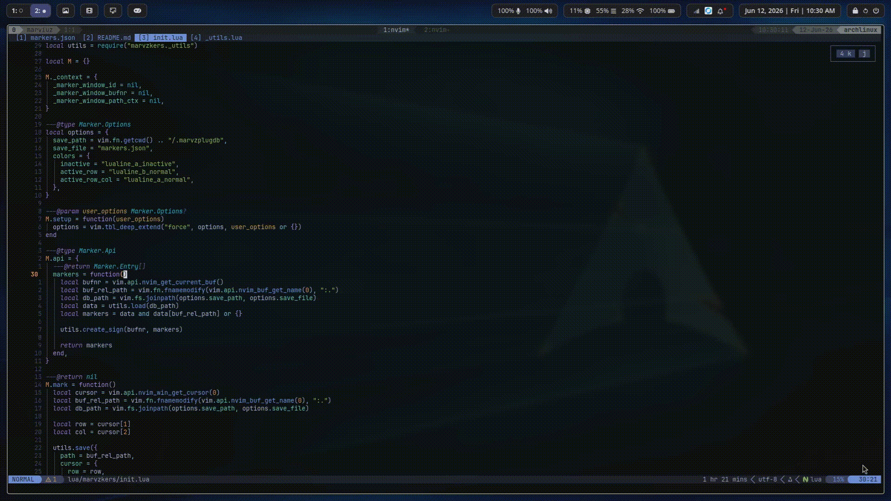

# marvzkers.nvim

Persistent, project-scoped bookmarks with inline notes, jump navigation, and lualine integration.



## Features

- **Project-Scoped:** Bookmarks are saved locally per project.
- **Inline Notes:** Edit notes directly within a floating manager window.
- **Lualine Integration:** Out-of-the-box statusline component that reflects your cursor proximity to markers.

## Installation & Keymaps

The plugin exposes a pure API and does not create default bindings. You must configure your own keymaps.

```lua
-- lazy.nvim
{
  "marviuz/marvzkers.nvim",
  config = function()
    local marvzkers = require("marvzkers")

    marvzkers.setup()

    -- Bindings for creating and managing markers
    vim.keymap.set("n", "<leader>ma", marvzkers.mark, { desc = "Marker toggle" })

    vim.keymap.set("n", "<leader>mm", function()
      marvzkers.toggle_marker_window(function(bufnr)
        vim.keymap.set("n", "q", marvzkers.toggle_marker_window, { buffer = bufnr })
        vim.keymap.set("n", "<CR>", marvzkers.select, { buffer = bufnr })
        vim.keymap.set("n", "<leader>w", marvzkers.save_window, { desc = "Save and exit markers", buffer = bufnr })
      end)
    end, { desc = "Open markers" })

    -- Jumps for markers 0-9
    for idx = 0, 9 do
      vim.keymap.set("n", "<leader>m" .. idx, function()
        marvzkers.jump({ index = idx })
      end, { desc = "Marker jump " .. idx })
    end
  end
}
```

## Configuration

Pass an optional table to `setup()` to customize behavior. Here are the defaults:

```lua
require("marvzkers").setup({
  save_path = vim.fn.getcwd() .. "/.marvzplugdb",
  save_file = "markers.json",
  colors = {
    inactive = "lualine_a_inactive",
    active_row = "lualine_b_normal",
    active_row_col = "lualine_a_normal",
  },
})
```

| Option      | Type     | Description                                                |
| :---------- | :------- | :--------------------------------------------------------- |
| `save_path` | `string` | Directory where marker databases are stored.               |
| `save_file` | `string` | Filename for the JSON marker database.                     |
| `colors`    | `table`  | Statusline highlight groups used by the lualine component. |

> [!TIP]
> Markers are saved per-project under `.marvzplugdb/` by default. To keep them out of version control, add the directory to your global gitignore:
>
> ```ini
> # ~/.gitconfig
> [core]
>     excludesfile = ~/.gitignore_global
>
> # ~/.gitignore_global
> .marvzplugdb/
> ```

### Color Proximity Behavior

- **inactive:** Marker exists in the buffer, but the cursor is on a different line.
- **active_row:** Cursor is on the same line as the marker.
- **active_row_col:** Cursor is perfectly targeting the marker exact line and column.

## API

| Function                             | Action                                                               |
| :----------------------------------- | :------------------------------------------------------------------- |
| `marvzkers.mark()`                   | Toggle a marker at the current cursor position.                      |
| `marvzkers.jump({ index = nil })`    | Jump to a specific marker index.                                     |
| `marvzkers.toggle_marker_window(cb)` | Open or close the floating marker editor window. Accepts a callback. |
| `marvzkers.save_window()`            | Save structural edits made inside the marker window and close it.    |
| `marvzkers.select()`                 | Jump directly to the marker under the cursor in the marker window.   |
| `marvzkers.api.markers()`            | Returns a raw table of markers for the current buffer.               |
| `marvzkers.lualine`                  | Lualine component configuration object.                              |

## Lualine Integration

To add the marker tracker to your statusline, add `marvzkers.lualine` to your lualine setup:

```lua
require("lualine").setup({
  sections = {
    lualine_c = {
      require("marvzkers").lualine,
    },
  },
})
```

## See Also

- [marks.nvim](https://github.com/chentoast/marks.nvim)
